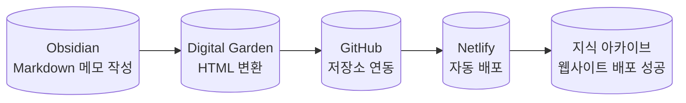

---
{"dg-publish":true,"permalink":"/1-intern-log-1/"}
---

- **$0 비용**으로 개인 지식 아카이브 구축 및 퍼블릭 호스팅 완료.
    
- OT 필기·특강 요약 등 8 개의 노트를 카테고리별로 공개하여, 팀원과 실시간 지식 공유 채널 **1개** 확보.
    
- 향후 포트폴리오·발표 자료에 직접 링크하여 재사용 가능한 **콘텐츠 허브**로 활용 예정 .


# **📝 머리말**

실리콘밸리 인턴쉽을 시작하기전 배운 내용을 기록하기 위해 obsidian 을 활용하였습니다.  

개인 노트 기록 환경을 **Obsidian → Digital Garden → Netlify** 파이프라인으로 재구성하여, 실리콘밸리 인턴십 학습 노트를 무료 웹 아카이브로 공개하였습니다.


> [!note]  **기존 노트 앱 문제**
> - Notion 기반 기록은 페이지 수가 늘수록 유료 요금제가 필요해 비용 부담이 발생했습니다.
> - 플러그인 생태계가 없어 노트앱 기능을 커스텀 할 수 있는 환경이 부족했습니다.


# **👊 해결 과정**

1. **기록 환경 전환**
    
    - Obsidian으로 로컬 마크다운 기반 노트 시스템 구축.
    
    - 커뮤니티 플러그인 **Digital Garden**으로 노트를 정적 HTML로 변환 .
    
2. **배포 자동화**
    
    - Netlify CLI를 사용해 GitHub push → 빌드 → 배포 파이프라인 구성.
    
    - 커스텀 도메인 설정과 HTTPS 인증은 Netlify 기본 기능으로 처리해 추가 비용을 제거.
    
3. **접근성 문제 해결**
    
    - 초기 배포 후 잘못된 상대 경로로 인해 페이지가 루트로 리다이렉트되는 현상을 확인하고, basePath 옵션을 수정하여 중복 페이지를 제거했습니다 .


### 노트 웹 구조도




# **≝ 결과**

- **$0 비용**으로 개인 지식 아카이브 구축 및 퍼블릭 호스팅 완료.

- OT 필기·특강 요약 등 8 개의 노트를 카테고리별로 공개하여, 팀원과 실시간 지식 공유 채널 **1개** 확보.

- 향후 포트폴리오·발표 자료에 직접 링크하여 재사용 가능한 **콘텐츠 허브**로 활용 예정 .


  
# **🏁 꼬리말**

정적 블로그 파이프라인을 직접 구성하면서 “기록 비용 최소화와 배포 자동화”라는 목표를 동시에 달성했습니다. 다음 단계로 리다이렉트 오류 재발 방지를 위한 테스트 스크립트를 추가하고, 학습 메모를 주차별 태그로 재분류할 계획입니다.


```

	````
	당신은 “실리콘밸리 인턴십 주차별 일지”를 **Obsidian 최적화 블로그 글**로 변환하는 전문 에디터입니다.  
	아래 <원본 일지>를 분석하여 지정 서식에 맞춘 Markdown을 작성하십시오.
	
	<원본 일지>
	[[  여기에 Week N 일지를 그대로 붙여넣으세요  \|  여기에 Week N 일지를 그대로 붙여넣으세요  ]]
	
	──────────────────────────────
	【1. 글 유형 판단】
	- ‘저·술·편·집’ 4가지 분류 중 하나를 식별해 첫 줄에 `[글 유형: 저]` 형식으로 명시.
	
	【2. 레이아웃 규칙】
	1) **헤딩 + 아이콘**  
	   - `# **📝 머리말**`, `# **👊 해결 과정**`, `# **≝ 결과**`, `# **🏁 꼬리말**`  
	   - 추가 섹션 필요 시 같은 패턴으로 자유롭게 생성 (`# **🔧 후속 계획**` 등)  
	1) **불릿 포맷**  
	   - 모든 리스트는 `-` 뒤 **공백 1칸** 후 내용 시작  
	   - 들여쓰기 시 4 스페이스 + `-` … (공백 누적 X)  
	1) **Callout 사용**  
	   - 정보·주의·팁은 `> [!note]`, `> [!warning]` 등 Obsidian Callout 적용  
	1) **Mermaid 시각화**  
	   - 기술 구조도·데이터 흐름 등은 반드시 Mermaid 코드 블록으로 표현  
	1) **문체**  
	   - 전 구간 `~습니다` 체  
	   - 불필요한 종결·맺음말 생략, 핵심 정보만 기술  
	1) **링크 처리**  
	   - 공식 레퍼런스 / 원문은 인라인 링크로 달고, 용어 해설은 생략  
	
	【3. 출력 샘플 구조】
	
	```markdown
	[글 유형: 저]
	
	# **📝 머리말**
	(2–3 줄 요약)
	
> 	[!note] **기존 문제**
> 	- …          ← 불릿 뒤 공백은 1칸
> 	- …
	
	# **👊 해결 과정**
	1. **환경 구축**  
	   - …  
	1. **배포 자동화**  
	   - …
	
	# **≝ 결과**
	- **30 분 → 5 분** 배포 단축  
	- …
	
	```mermaid
	flowchart LR
	    A[(도구 A)] --> B[(도구 B)]
	````
	
	# **🏁 꼬리말**
	
	  
	
	다음 단계 …
	
	```
	【4. 검수 체크리스트】  
	- [ ] 헤딩 아이콘·순서 정확?  
	- [ ] 불릿 = `-` + 1공백 규칙 준수?  
	- [ ] Callout·Mermaid 포함?  
	- [ ] ~습니다 체 유지?  
	──────────────────────────────
	
	위 지침을 지키며 주차별 블로그 글을 작성하십시오.
	```
```
---

### **사용 예시**

  

해당 프롬프트에 **Week 1 일지**를 붙여 넣고 실행하면, 이전에 제공한 “머리말·해결 과정·결과·꼬리말 + Mermaid 구조도” 형태의 Obsidian-친화 Markdown이 자동 생성됩니다.