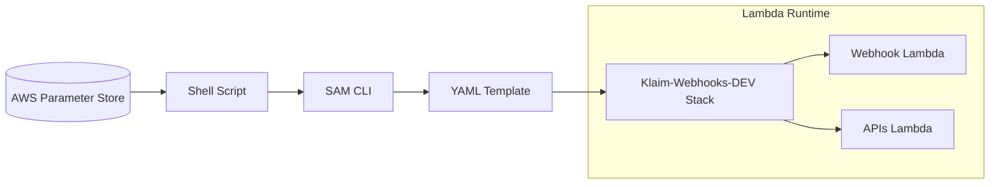

---
{"dg-publish":true,"permalink":"/2-intern-log-2/"}
---

# 2주차-인턴십 팀·역할 배정(Intern_log_2)

# **📝 머리말**

실리콘밸리 인턴십 **2주차**에는 팀 편성·배포 책임 설정과 함께 AWS Parameter Store 기반 환경변수 표준안을 수립하였습니다. 추가로 이벤트 스트림 구조를 조사하여 서버리스 아키텍처 이해도를 높였습니다.

> [!note] **기존 문제**
> - 환경변수가 yaml에 하드코딩으로 입력되어 배포 시마다 값이 노출되었습니다.

# **👊 해결 과정**

1. **팀·역할 확정**
    - APIs 팀·Webhook 팀 **2팀** 인원 분배 및 역할 분배
    - 각 팀장 주도로 온보딩·배포 프로세스 책임 분담.
    
2. **환경변수 관리 표준화**
    
    - 모든 설정 값을 **AWS Parameter Store + YAML** 조합으로 통일하고 GitHub 워크플로에서 불러오도록 설계.
    
3. **배포 권한·저장소 준비**
    
    - GitHub 레포지토리 초대 및 IAM 권한 요청 완료로 CI 접근 경로 정리.
    

# **≝ 결과**

- **환경변수 노출 0건**을 목표로 한 **표준 파이프라인** 설계 완료.

# **🏁 꼬리말**

표준화된 Parameter Store 파이프라인 덕분에 두 팀 모두 환경변수 오류를 걱정하지 않고 개발에 집중할 수 있게 되었습니다. 3주차에는 Lambda 이벤트 스트림 예제 코드를 실습하며 비용·성능 지표를 수치화할 예정입니다.