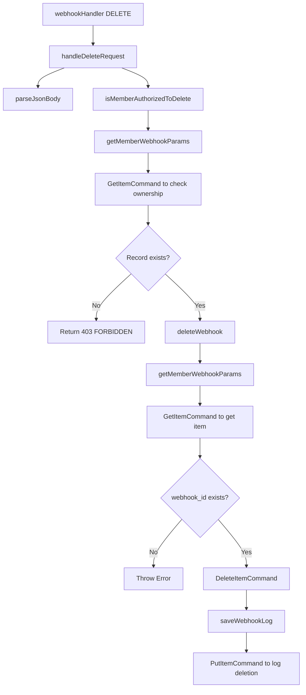

---
{"dg-publish":true,"permalink":"//"}
---

<div style="display: flex; gap: 20px;">
  <div style="flex: 1;">
    ```mermaid
    graph TD
    A[Start] --> B[Process 1]
    B --> C[Process 2]
    C --> D[End]
    ```
  </div>
  <div style="flex: 1;">
    ## 여기에 추가 내용
    Mermaid 다이어그램을 왼쪽 컬럼에 배치하고, 오른쪽에는 다른 내용을 넣을 수 있습니다.
  </div>
</div>


